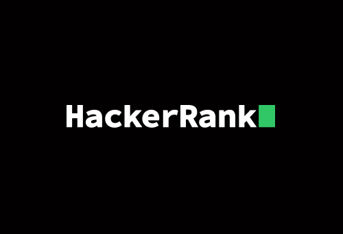

# About HackerRank

HackerRank is a technology hiring platform that is the standard for assessing developer skills for over 2.800+ companies around the world.
By enabling recruiters and managers to objectively evaluate talent at every stage of the recruiting process, HackerRank helps companies hire skilled
developers and innovate faster.

# About the repository
This repository has exercies taken from the 3 months interview preparation kit that contains 104 challenges and 13 mock tests, to strengthen developers algorithms and problem-solving skills.
