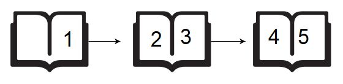

# Subarray Division 2 

Two children, Lily and Ron, want to share a chocolate bar. Each of the squares has an integer on it.

Lily decides to share a contiguous segment of the bar selected such that:

The length of the segment matches Ron's birth month, and,
The sum of the integers on the squares is equal to his birth day.
Determine how many ways she can divide the chocolate.

<b>*Example*</b>

<em>s = </em>[2, 2, 1, 3, 2]
<em>d</em>= 4
<em>m</em>= 2

Lily wants to find segments summing to Ron's birth day, <em>d = 4</em> with a length equalling his birth month, <em>m = 2</em>. In this case, there are two segments meeting her criteria: [2, 2] and [1, 3].

<b>Function Description</b>

Complete the birthday function in the editor below.

birthday has the following parameter(s):

int s[n]: the numbers on each of the squares of chocolate
int d: Ron's birth day
int m: Ron's birth month

<b>Returns</b>

int: the number of ways the bar can be divided

The first line contains an integer , the number of squares in the chocolate bar.
The second line contains <em>n</em> space-separated integers <em>s[i]</em>, the numbers on the chocolate squares where i is between 0 and <em>n</em>.
The third line contains two space-separated integers,  and , Ron's birth day and his birth month.

# XOR Strings 3

In this challenge, the task is to debug the existing code to successfully execute all provided test files.

Given two strings consisting of digits 0 and 1 only, find the XOR of the two strings.

Debug the given function strings_xor to find the XOR of the two given strings appropriately.

Note: You can modify at most three lines in the given code and you cannot add or remove lines to the code.

To restore the original code, click on the icon to the right of the language selector.

<b>Input Format</b>

The input consists of two lines. The first line of the input contains the first string, <em>s</em>, and the second line contains the second string, <em>t</em>.

<b>Output Format</b>

Print the string obtained by the XOR of the two input strings in a single line.

<b>Sample Input</b>

10101
00101
<b>Sample Output</b>

10000

# Sales by Match

There is a large pile of socks that must be paired by color. Given an array of integers representing the color of each sock, determine how many pairs of socks with matching colors there are.

<b>*Example*</b>

<em>n = 7</em>
<em>ar = [1, 2, 1, 2, 1, 3, 2] </em>

There is one pair of color 1 and one of color 2. There are three odd socks left, one of each color. The number of pairs is 2.

<b>Function Description</b>

Complete the sockMerchant function in the editor below.

sockMerchant has the following parameter(s):

<ul>
    <li>int n: the number of socks in the pile</li>
    <li>int ar[n]: the colors of each sock</li>
</ul>

<b>Returns</b>

int: the number of pairs

<b>Input Format</b>

The first line contains an integer <em>n</em>, the number of socks represented in <em>ar</em>.
The second line contains <em>n</em> space-separated integers, <em>ar[i]</em>, the colors of the socks in the pile.

# Migratory Birds

Given an array of bird sightings where every element represents a bird type id, determine the id of the most frequently sighted type. If more than 1 type has been spotted that maximum amount, return the smallest of their ids.

<b>Example</b>
<em>arr = [1, 1, 2, 2, 3]</em>

There are two each of types 1 and 2, and one sighting of type 3. Pick the lower of the two types seen twice: type 1.

Function Description

Complete the migratoryBirds function in the editor below.

migratoryBirds has the following parameter(s):

int arr[n]: the types of birds sighted
Returns

int: the lowest type id of the most frequently sighted birds
Input Format

The first line contains an integer, <em>n</em>, the size of <em>arrr</em>.
The second line describes <em>arr</em> as <em>n</em> space-separated integers, each a type number of the bird sighted.

# Drawing Book

A teacher asks the class to open their books to a page number. A student can either start turning pages from the front of the book or from the back of the book. They always turn pages one at a time. When they open the book, page  is always on the right side:

When they flip page 1, they see pages 2 and 3. Each page except the last page will always be printed on both sides. The last page may only be printed on the front, given the length of the book. If the book is <em>n</em> pages long, and a student wants to turn to page <em>p</em>, what is the minimum number of pages to turn? They can start at the beginning or the end of the book.

Given <em>n</em> and <em>p</em>, find and print the minimum number of pages that must be turned in order to arrive at page <em>p</em>.

<b>Example</b>

<em>n = 5</em>
<em>p = 3</em>

Using the diagram above, if the student wants to get to page <em>p</em>, they open the book to page 1, flip 1 page and they are on the correct page. If they open the book to the last page, page 5, they turn 1 page and are at the correct page. Return 1.

<b>Function Description</b>

Complete the pageCount function in the editor below.

pageCount has the following parameter(s):

int n: the number of pages in the book
int p: the page number to turn to

<b>Returns</b>

int: the minimum number of pages to turn

<b>Input Format</b>

The first line contains an integer <em>n</em>, the number of pages in the book.
The second line contains an integer, <em>p</em>, the page to turn to.

